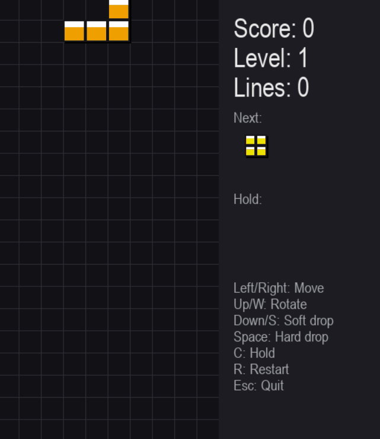

# S-code

AI агент для создания приложений по текстовому описанию. Просто опиши что хочешь — агент сам создаст файлы, установит зависимости, запустит и исправит ошибки.

## Демо



> Тетрис, созданный агентом с нуля за два запроса

## Что умеет

- Создаёт файлы и папки проекта автоматически
- Устанавливает нужные Python пакеты
- Запускает код и дебажит ошибки (до 3 попыток)
- Помнит историю каждого проекта между сессиями
- Поддерживает несколько проектов одновременно

## Установка

```bash
git clone https://github.com/Foutx/S-code.git
cd S-code
pip install -r requirements.txt
```

Создай файл `.env` на основе `.env.example`:

```bash
cp .env.example .env
```

Вставь свой API ключ в `.env`:

```
API_KEY=your_api_key_here
```

## Запуск

```bash
python main.py
```

При запуске агент покажет список существующих проектов и предложит выбрать или создать новый.

## Пример

```
Существующие проекты:
  1. snake_game
  2. Tetris

Название проекта (Enter = новый): snake_game
Проект: snake_game

You: добавь в игру счётчик рекордов
S-code: Читаю текущий код...
```

## Инструменты агента

| Инструмент | Описание |
|---|---|
| `get_directory` | Получает путь к рабочему столу |
| `create_file` | Создаёт файл с содержимым |
| `read_file` | Читает содержимое файла |
| `run_code` | Запускает Python файл |
| `install_package` | Устанавливает пакет через pip |
| `list_directory` | Показывает содержимое папки |
| `delete_file` | Удаляет файл |

## Стек

- [LangGraph](https://github.com/langchain-ai/langgraph) — агентный фреймворк
- [LangChain](https://github.com/langchain-ai/langchain) — инструменты и промпты
- SQLite — хранение истории проектов
